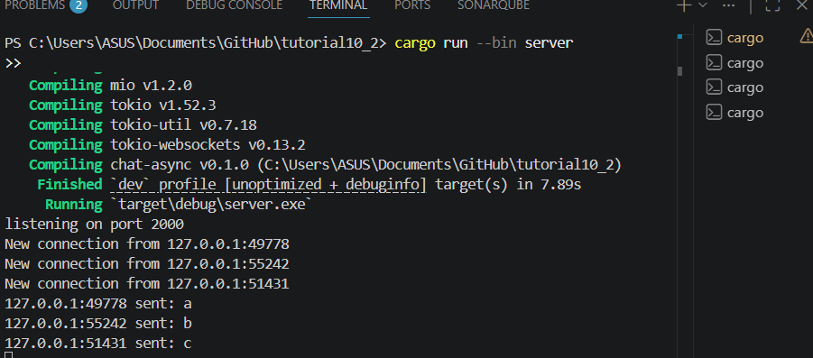
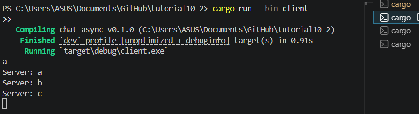
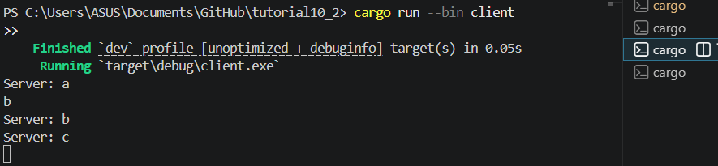
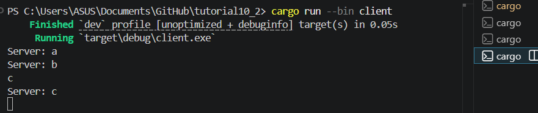
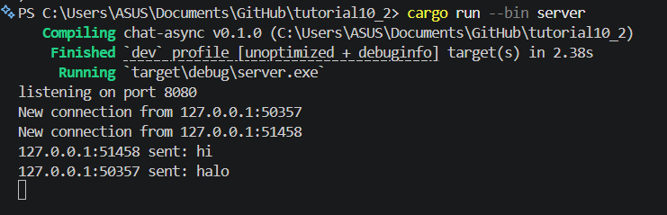
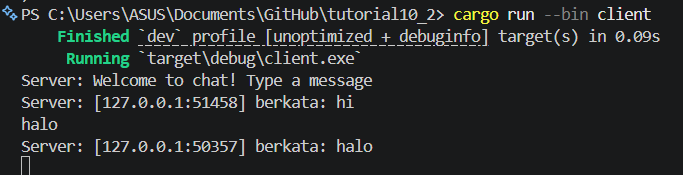
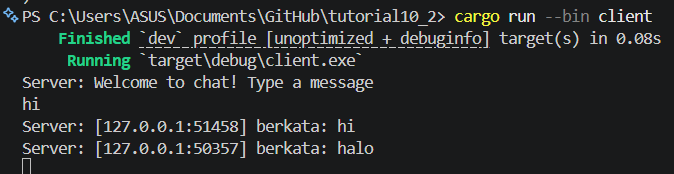

# tutorial10_2

main di client.rs: menggunakan tokio::select! di dalam loop secara concurrent:
membaca input user dari stdin dan mengirimnya ke server
menerima pesan dari server dan menampilkannnya

Client mengirim pesan ke server
Client1 ketik "a" dan kirim ke server
Server terima "a" dan broadcast ke semua client (termasuk client1)
Client1, Client2, Client3 mulai koneksi di waktu berbeda
Jadi mereka "melihat" broadcast yang sudah terkirim sebelumnya
Client2 dan Client3 tidak dapat melihat input "a" di sisi client mereka sendiri karena "a" adalah input dari client lain, bukan dari mereka

File yang Diubah:

- src/bin/server.rs (baris 54): TcpListener::bind("127.0.0.1:2000") menjadi "127.0.0.1:8080"
- src/bin/client.rs (baris 10): URI ws://127.0.0.1:2000 menjadi ws://127.0.0.1:8080

Protokol WebSocket:
Kedua sisi menggunakan crate tokio-websockets:

- Server: Menggunakan ServerBuilder untuk menerima koneksi di port TCP 8080.
- Client: Menggunakan ClientBuilder untuk terhubung ke ws://127.0.0.1:8080.

Sebagai protokol connection-oriented, server dan client harus menggunakan nomor port yang sama agar bisa berkomunikasi. Server terikat ke port 8080 untuk menunggu koneksi masuk, sementara client terhubung langsung ke port tersebut.

saya melakukan perubahan pada server.rs di fungsi handle_connection. Ketika server menerima pesan saya menambahkan format!() untuk membuat string baru seperti format!("[{addr}] berkata: {teks}") yang meambahkan detail pengirim. Hal ini saya lakukan agar setiap klien yang terhubung dapat mengetahui siapa yang mengirim pesan tersebut.
